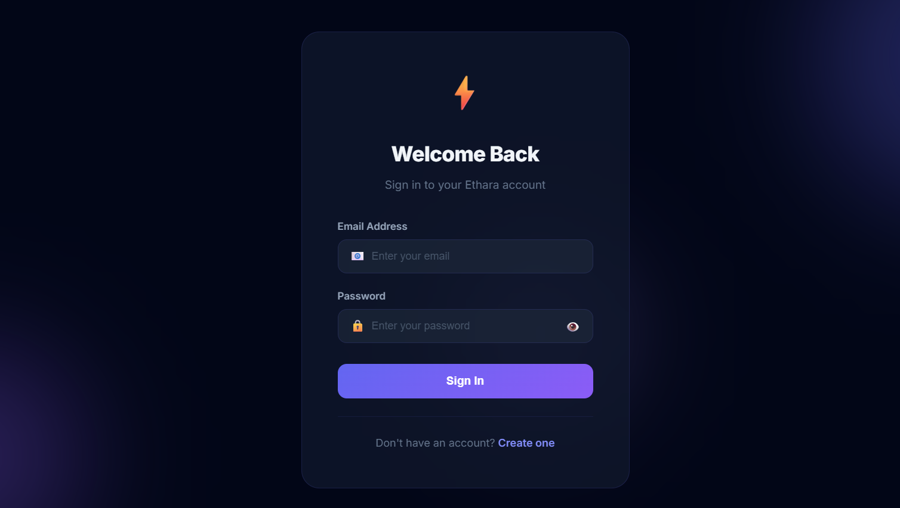
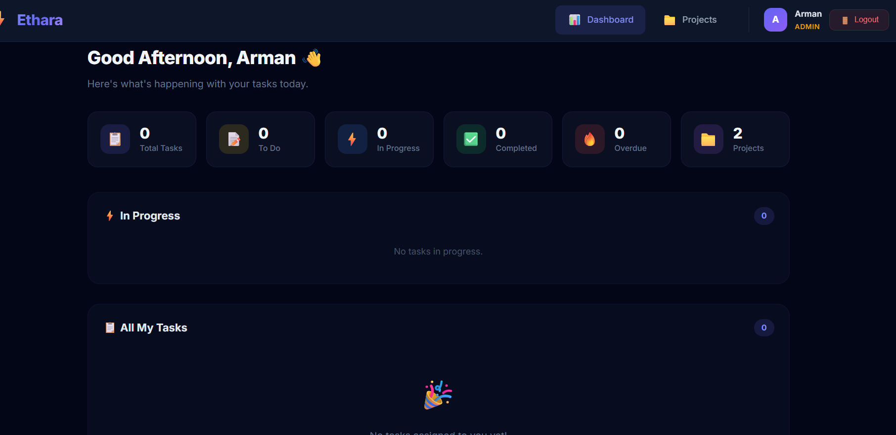
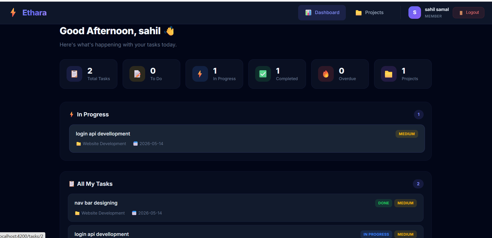
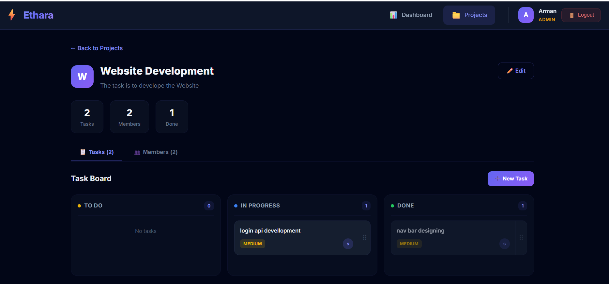
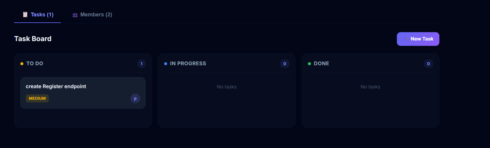

# ⚡ Ethara — Team Task Manager (Frontend)

A premium, modern **Angular 19** frontend for the Ethara Team Task Manager. Features a sleek dark UI with glassmorphism design, Kanban-style task boards with drag-and-drop, role-based access control, and full integration with the Spring Boot backend API.

---

## 📸 Screenshots

### 🔐 Login Page

> Glassmorphism card design with animated ⚡ logo, email/password inputs with icons, and a gradient "Sign In" button.

### 📊 Dashboard — Admin View

> Admin dashboard showing 6 real-time stat cards (Total Tasks, To Do, In Progress, Completed, Overdue, Projects), "In Progress" task list, and "All My Tasks" section with navigation bar displaying user role badge.

### 📊 Dashboard — Member View

> Member dashboard with personalized greeting, assigned task stats, in-progress tasks with project names and due dates, and task status/priority badges.

### 📋 Kanban Task Board (Drag & Drop)

> Full project detail page with Kanban board. Displays project info (name, description, avatar), quick stats (Tasks, Members, Done), tabbed interface (Tasks/Members), and three drag-and-drop columns: **TO DO**, **IN PROGRESS**, **DONE** — each with draggable task cards showing priority and assignee.

### 🔍 Kanban Board — Close Up

> Close-up view of the Kanban columns with task cards featuring priority badges (MEDIUM, HIGH) and user avatar initials. Drag handle (⠿) on each card enables drag-and-drop between columns.

---

## 🛠️ Tech Stack

| Layer        | Technology           |
|-------------|----------------------|
| Framework   | Angular 19 (Standalone Components) |
| Language    | TypeScript 5.7       |
| Styling     | Vanilla CSS (Dark Theme + Glassmorphism) |
| HTTP Client | Angular HttpClient with Functional Interceptors |
| Auth        | JWT (Bearer Token)   |
| Routing     | Angular Router with Lazy Loading |
| Fonts       | Google Fonts — Inter |

---

## 📁 Project Structure

```
src/app/
├── core/                          # Singleton services, guards, interceptors
│   ├── guards/
│   │   ├── auth.guard.ts          # Redirect to /login if no token
│   │   └── admin.guard.ts         # Restrict admin-only routes
│   ├── interceptors/
│   │   └── auth.interceptor.ts    # Attach Bearer token to all requests
│   ├── models/
│   │   ├── user.model.ts          # User interface
│   │   ├── auth.model.ts          # Login/Register/AuthResponse/ApiError
│   │   ├── project.model.ts       # ProjectRequest/ProjectResponse
│   │   ├── task.model.ts          # TaskRequest/TaskResponse/StatusUpdate
│   │   └── dashboard.model.ts     # DashboardStats
│   └── services/
│       ├── auth.service.ts        # Login, register, token storage, logout
│       ├── user.service.ts        # Get current user, list all users
│       ├── project.service.ts     # CRUD projects, manage members
│       ├── task.service.ts        # CRUD tasks, status updates
│       └── dashboard.service.ts   # Stats, my-tasks
│
├── features/                      # Feature modules (lazy-loaded)
│   ├── auth/
│   │   ├── login/                 # Login page component
│   │   │   ├── login.component.ts
│   │   │   ├── login.component.html
│   │   │   ├── login.component.css
│   │   │   └── login.component.spec.ts
│   │   └── register/              # Registration page component
│   │       ├── register.component.ts
│   │       ├── register.component.html
│   │       ├── register.component.css
│   │       └── register.component.spec.ts
│   ├── dashboard/
│   │   └── dashboard/             # Dashboard with stats & task overview
│   │       ├── dashboard.component.ts
│   │       ├── dashboard.component.html
│   │       ├── dashboard.component.css
│   │       └── dashboard.component.spec.ts
│   ├── projects/
│   │   ├── project-list/          # Grid of project cards
│   │   ├── project-detail/        # Kanban board + member management
│   │   └── project-form/          # Create/edit project form
│   └── tasks/
│       ├── task-detail/           # Task info + status changer
│       └── task-form/             # Create/edit task form
│
├── shared/                        # Reusable components & pipes
│   ├── components/
│   │   ├── navbar/                # Top navigation bar
│   │   └── loading-spinner/       # Animated loading indicator
│   └── pipes/
│       ├── status-badge.pipe.ts   # TODO → "To Do" display
│       └── relative-date.pipe.ts  # "2 days ago" formatting
│
├── app.component.ts               # Root component
├── app.config.ts                  # App config (HttpClient + Interceptor)
└── app.routes.ts                  # All routes with guards
```

---

## 🚀 Getting Started

### Prerequisites

- **Node.js** ≥ 20.x or 22.12+ (v22.9.0 works with Angular 19)
- **npm** ≥ 8.x
- **Backend API** running at `http://localhost:8080` (Spring Boot)

### Installation

```bash
# 1. Clone the repository
git clone <repo-url>
cd company_ethara_frontend

# 2. Install dependencies
npm install

# 3. Start the development server
ng serve
# or
npm start
```

The app will be available at **http://localhost:4200**

### Build for Production

```bash
ng build --configuration production
```

Output will be in `dist/company-ethara-frontend/`

---

## 🔗 Backend API Connection

The frontend connects to the backend at:

```
http://localhost:8080/api
```

### Required Backend Endpoints

| Method | Endpoint | Description |
|--------|----------|-------------|
| POST | `/api/auth/register` | Register new user |
| POST | `/api/auth/login` | Login & get JWT |
| GET | `/api/users/me` | Current user profile |
| GET | `/api/users` | List all users (Admin) |
| GET/POST | `/api/projects` | List / Create projects |
| GET/PUT/DELETE | `/api/projects/{id}` | Read / Update / Delete project |
| POST/DELETE | `/api/projects/{id}/members` | Add / Remove members |
| GET | `/api/projects/{id}/members` | List project members |
| POST | `/api/projects/{projectId}/tasks` | Create task |
| GET | `/api/projects/{projectId}/tasks` | List project tasks |
| GET/PUT/DELETE | `/api/tasks/{id}` | Read / Update / Delete task |
| PATCH | `/api/tasks/{id}/status` | Update task status (Drag & Drop) |
| GET | `/api/dashboard/stats` | Dashboard statistics |
| GET | `/api/dashboard/my-tasks` | Tasks assigned to me |

### Changing the API URL

Update the `API_URL` constant in each service file under `src/app/core/services/`.

---

## 🔐 Authentication Flow

```
┌─────────┐     POST /auth/login      ┌──────────┐
│  Login   │ ───────────────────────── │ Backend  │
│  Page    │                           │  API     │
└────┬─────┘  ◄─── { token, user } ── └──────────┘
     │
     ▼
┌─────────────────────────────────┐
│  localStorage                    │
│  ├── token: "eyJhbGci..."        │
│  └── user: { id, name, role }    │
└────────────┬────────────────────┘
             │
             ▼
┌──────────────────────────────────┐
│  Auth Interceptor                 │
│  Adds: Authorization: Bearer xxx  │
│  to ALL HTTP requests             │
│                                   │
│  On 401 → logout → /login         │
└──────────────────────────────────┘
```

### Token Storage
- **Login/Register** → Save `token` + `user` to `localStorage`
- **Logout** → Clear `localStorage` → Redirect to `/login`
- **401 Response** → Auto-clear + redirect to `/login`

---

## 🗺️ Routes

| Route | Component | Guard | Description |
|-------|-----------|-------|-------------|
| `/login` | LoginComponent | — | Public login page |
| `/register` | RegisterComponent | — | Public registration |
| `/dashboard` | DashboardComponent | Auth | Stats + my tasks |
| `/projects` | ProjectListComponent | Auth | All projects |
| `/projects/new` | ProjectFormComponent | Admin | Create project |
| `/projects/:id` | ProjectDetailComponent | Auth | Kanban board + members |
| `/projects/:id/edit` | ProjectFormComponent | Admin | Edit project |
| `/projects/:projectId/tasks/new` | TaskFormComponent | Auth | Create task |
| `/projects/:projectId/tasks/:taskId/edit` | TaskFormComponent | Auth | Edit task |
| `/tasks/:id` | TaskDetailComponent | Auth | Task details + status |

---

## 🎯 Key Features

### 🔄 Drag-and-Drop Kanban Board
- Drag task cards between **TODO**, **IN PROGRESS**, and **DONE** columns
- **Optimistic UI** — card moves instantly, reverts if API call fails
- Visual feedback with column highlighting and drop zone hints
- Calls `PATCH /api/tasks/{id}/status` on drop

### 👥 Role-Based Access
- **ADMIN** — Can create/edit/delete projects, manage members, delete tasks
- **MEMBER** — Can view assigned projects, create/edit tasks, change status

### 📊 Dashboard
- Real-time stats (total tasks, to-do, in-progress, done, overdue, projects)
- Overdue task alerts with visual indicators
- Personal task list with quick navigation

### 🎨 Premium Dark Theme
- Glassmorphism card design with `backdrop-filter: blur()`
- Gradient accent colors (Indigo → Violet)
- Smooth micro-animations and hover effects
- Inter font from Google Fonts
- Custom styled scrollbar
- Fully responsive (mobile, tablet, desktop)

---

## ⚙️ Configuration

### Environment
The API base URL is hardcoded in the service files. To change it, update:

```typescript
// In each service under src/app/core/services/
private readonly API_URL = 'http://localhost:8080/api/...';
```

### CORS
Make sure the backend has CORS configured to allow `http://localhost:4200`:

```java
// SecurityConfig.java (Backend)
.cors(cors -> cors.configurationSource(request -> {
    CorsConfiguration config = new CorsConfiguration();
    config.setAllowedOrigins(List.of("http://localhost:4200"));
    config.setAllowedMethods(List.of("GET", "POST", "PUT", "PATCH", "DELETE"));
    config.setAllowedHeaders(List.of("*"));
    return config;
}))
```

---

## 📦 Enum Reference

| Enum | Values | Used In |
|------|--------|---------|
| Role | `ADMIN`, `MEMBER` | User role field |
| TaskStatus | `TODO`, `IN_PROGRESS`, `DONE` | Task status / Kanban columns |
| Priority | `LOW`, `MEDIUM`, `HIGH` | Task priority badges |

---

## 🧪 Running Tests

```bash
# Run unit tests
ng test

# Run tests with coverage
ng test --code-coverage
```

---

## 📝 Error Handling

All API errors follow this structure:

```json
{
  "status": 404,
  "message": "Project not found with id: '99'",
  "errors": null,
  "timestamp": "2026-05-13T14:00:00"
}
```

The frontend handles:
- **400** — Validation errors displayed inline under form fields
- **401** — Auto-logout and redirect to login
- **403** — Insufficient permissions (route guards prevent access)
- **404** — "Not found" error states
- **409** — Duplicate resource errors (e.g., email already registered)

---

## 🤝 Contributing

1. Fork the repository
2. Create a feature branch: `git checkout -b feature/my-feature`
3. Commit changes: `git commit -m 'Add my feature'`
4. Push to branch: `git push origin feature/my-feature`
5. Open a Pull Request

---

## 📄 License

This project is part of the Ethara Task Manager system.

---

<p align="center">
  Built with ⚡ Angular 19 &nbsp;•&nbsp; Designed with 💜 Premium Dark Theme
</p>
